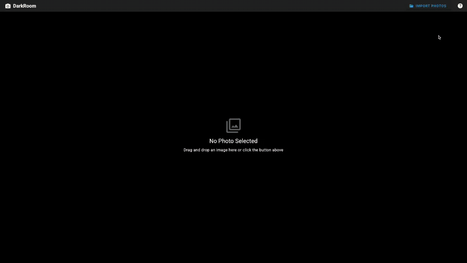

# 📸 Vue DarkRoom


> Photo editor inspired by Adobe Lightroom.



## ✨ Features

### 🛠 Powerful Editing Tools
- **Non-Destructive Editing**: The original file is never re-encoded. Crops and colour corrections are re-rendered from the untouched source on preview and on export, so photos can be re-cropped any number of times without quality loss.
- **Crop & Rotate**: 
  - Preset aspect ratios (1:1, 4:3, 16:9, etc.)
  - Free crop
  - Fine rotation (horizon straightening)
- **Color Correction**:
  - Brightness, Contrast, Saturation
  - Sepia, Grayscale, Invert
  - Blur effects

### 📦 Batch Processing & Export
- **Batch Export**: Process and download all edited photos at once as a ZIP archive.
- **Compression Control**: Adjust quality (0-100%) to balance file size and visual fidelity.
- **Format Selection**: Export as JPEG, PNG, or WebP.
- **Resize**: Option to resize images during export (Original, 1920px, 1280px, etc.).

---

## 🎹 Keyboard Shortcuts

Boost your productivity with these built-in hotkeys:

| Key Combination | Action |
|----------------|--------|
| `Alt` + `←` / `→` | Navigate between photos |
| `Backspace` | Remove current photo |
| `[` / `]` | Rotate 90° counter-clockwise / clockwise |
| `'` / `\` | Rotate 1° counter-clockwise / clockwise |
| `C` | Activate cropper |
| `Enter` | Apply cropper |
| `Esc` | Cancel cropper |

---

## 🚀 Tech Stack

This project is built using the latest Vue ecosystem tools:

- **Framework**: [Vue 3](https://vuejs.org/) (Composition API, `<script setup>`)
- **Language**: [TypeScript](https://www.typescriptlang.org/) for type safety
- **State Management**: [Pinia](https://pinia.vuejs.org/)
- **UI Component Library**: [Vuetify 3](https://vuetifyjs.com/)
- **Build Tool**: [Vite](https://vitejs.dev/)
- **Image Processing**:
  - [Cropper.js](https://github.com/fengyuanchen/cropperjs) for the interactive crop UI
  - Canvas 2D for full-resolution rendering of the crop and colour filters
  - [JSZip](https://stuk.github.io/jszip/) for bundling files
  - [FileSaver.js](https://github.com/eligrey/FileSaver.js) for downloading
  - [Sentry](https://sentry.io/) (optional) for production error reporting

---

## 🛠 Project Structure

```bash
src/
├── components/        # UI components (editor view, toolbar, side panel, filmstrip)
├── composables/       # Shared logic: photo editor controller, drag & drop, hotkeys
├── layouts/           # App layouts; owns the single photo editor controller
├── pages/             # Route views
├── plugins/           # Plugin registration (Vuetify, router, analytics)
├── services/          # Framework-free logic: import, crop rendering, export
├── stores/            # Pinia stores (photoStore, appStore)
├── types/             # Shared TypeScript types
├── utils/             # Pure helpers (filter building, formatting, clamping)
└── App.vue            # Root component
```

The editor controller is provided by the layout because the crop controls and
the editor view live in sibling subtrees. It is created exactly once per
layout, so the cropper and the preview stay in sync.

---

## 🏁 Getting Started

### Prerequisites
- Node.js 22+
- Yarn 1.x

### Installation

1. **Clone the repository**
   ```bash
   git clone https://github.com/a1lan1/vue-darkroom.git
   cd vue-darkroom
   ```

2. **Install dependencies**
   ```bash
   yarn install
   ```

3. **Start development server**
   ```bash
   yarn dev
   ```

4. **Build for production**
   ```bash
   yarn build
   ```

5. **Run all checks** (lint, types, tests)
   ```bash
   yarn check
   ```

### Environment

Copy `.env.example` to `.env`. Every variable is optional: the app runs fully
without any of them.

| Variable | Purpose |
|----------|---------|
| `VITE_SENTRY_DSN` | Enables Sentry in production builds only |
| `VITE_FIREBASE_*` | Enables Firebase Analytics; loaded lazily and only in production |

---

## 📄 License

This project is open source and available under the [MIT License](LICENSE).
